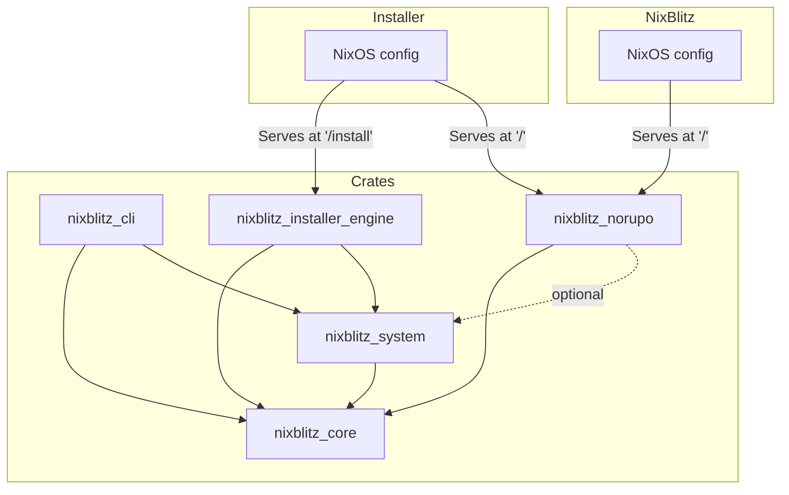

# Repo Layout

This document provides an overview of the NixBlitz application architecture, focusing on the components and their interactions within the monorepo.

## Overview

NixBlitz is built with a modular architecture that separates core functionality, system operations, and installation processes into distinct crates. The application uses async/await patterns with Tokio for handling concurrent operations and maintains state through thread-safe shared state management.

The application provides multiple user interfaces:

- A CLI for command-line operations
- A TUI (Terminal User Interface) for interactive use
- A web interface (Norupo) for browser-based management



## Architecture Diagram

Click here to view the [interactive diagram](/diagrams/architecture.html) in a new window.

## Component Details

### 1. CLI Interface (`crates/nixblitz_cli`)

The command-line interface providing multiple ways to interact with the system:

- **Command Line Commands**:

  - `tui`: Interactive terminal interface for system configuration
  - `init`: Creates a new NixBlitz project with default configuration
  - `install`: Runs the system installation wizard
  - `set`: Configures specific application options
  - `apply`: Applies configuration changes to the system
  - `doctor`: Diagnoses system issues and requirements

- **TUI Components** (built with Ratatui):
  - App List: Lists and manages Bitcoin/Lightning applications
  - App Options: Handles individual app configurations
  - Theming: Custom UI themes for better visibility

### 2. Web Interface - Norupo (`crates/nixblitz_norupo`)

Browser-based management interface for NixBlitz:

- Dioxus based Web Application for system management
  - `/`: edit system configuration
  - `/install`: install the system (only available on installer live system)

### 3. Core Crate (`crates/nixblitz_core`)

Central definitions and functionality used across the application:

- Type Definitions: Rust Types
- Error Types: Standardized error handling across components
- Common Utilities: Shared helper functions and tools that do not access the base system

### 4. System Interface (`crates/nixblitz_system`)

Handles system-level operations and configuration:

- System Template: Contains the NixOS configuration template
- System Utils: Common system operations and checks
- Project Config: Manages NixOS and application configurations
- Disk Management: Storage device operations
- Platform Checks: System compatibility verification

### 5. Installer Engine (`crates/nixblitz_installer_engine`)

Manages the NixOS installation process:

- State Management: Installation progress tracking
- Disk Operations: Partitioning and filesystem setup
- System Installation: NixOS deployment and configuration
- Event Broadcasting: Real-time progress updates

### 6. Event System (part of Installer Engine)

Manages communication between components:

- Event Broadcasting: Real-time updates to UIs
- Client Updates: Notifies UI components of changes
- Logging: Records system operations and errors

## Directory Structure

```
crates/
├── nixblitz_cli/         # CLI and TUI implementation
├── nixblitz_core/        # Shared definitions and types
├── nixblitz_installer_engine/ # Installation logic
├── nixblitz_norupo/      # Web interface (Norupo)
└── nixblitz_system/      # System operations
docs/                     # Docusaurus documentation site
installer/                # NixBlitz installer live system
modules/                  # NixOS modules
scripts/                  # Scripts for development
justfile                  # Commands for development
```

## Data Flow

### 1. User Input Flow

- CLI/TUI/Web input → Command Processing → System Actions
- Configuration Changes → State Update → System Application

### 2. Installation Flow

- Install Command → Installer Engine → Installation Steps
- Progress Updates → Event System → UI Updates

### 3. State Management Flow

- State Changes → Event Broadcasting → Client Updates
- System Changes → Configuration Update → State Sync

## Error Handling

The application uses a consistent error handling approach:

- Error detection in core components
- Error propagation through event system
- User notification through UIs
- Error recovery procedures where possible
- Comprehensive logging for debugging

## Extensibility

The architecture is designed for extensibility:

- New command additions through CLI interface
- Additional UI components in TUI/Web
- Extended installation steps
- New system utilities
- Custom event handlers

## Contributing

When adding new features:

1. Place code in appropriate crate based on functionality
2. Use types from nixblitz_core for consistency
3. Implement proper error handling
4. Add necessary tests
5. Update documentation
